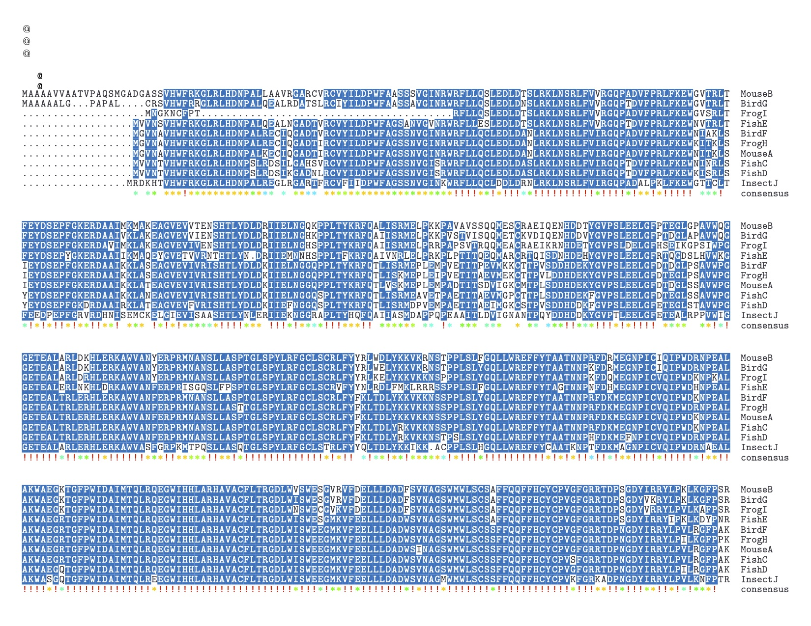
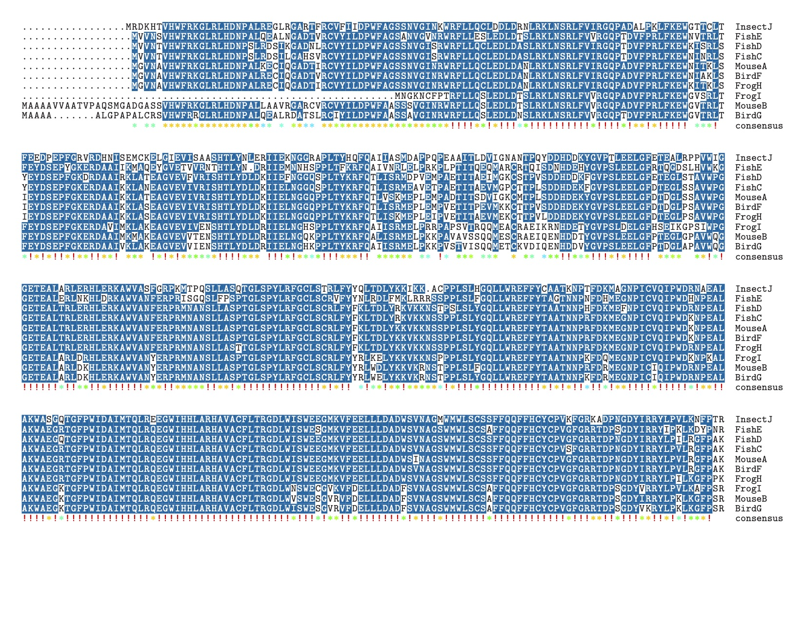
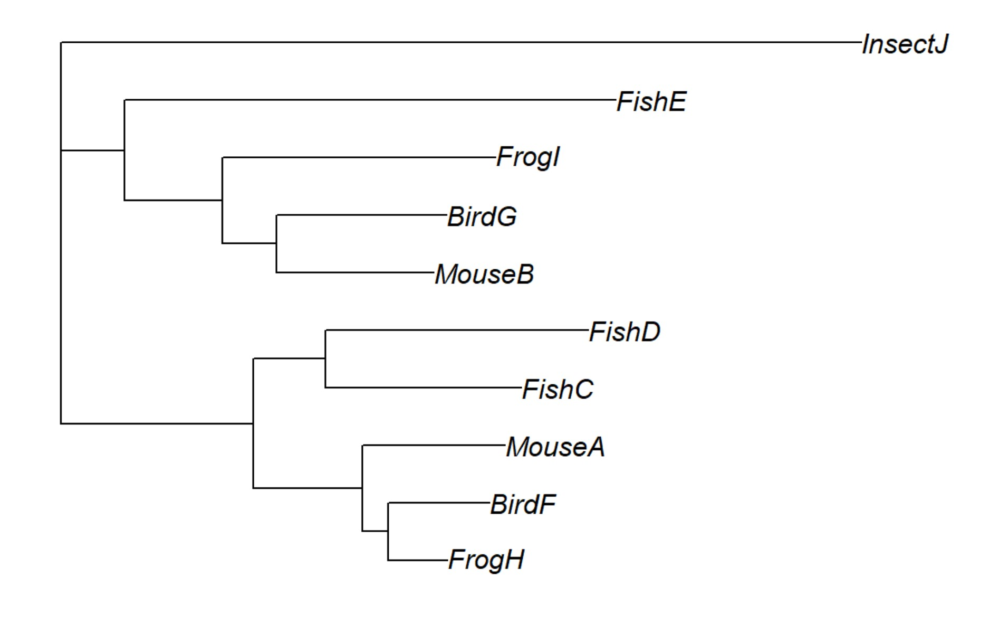
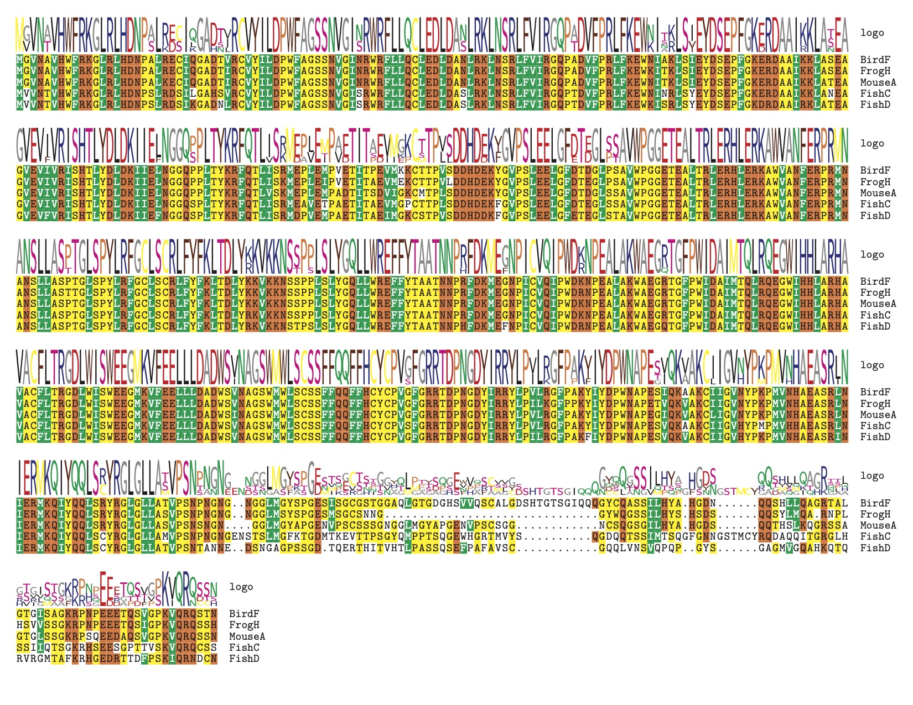
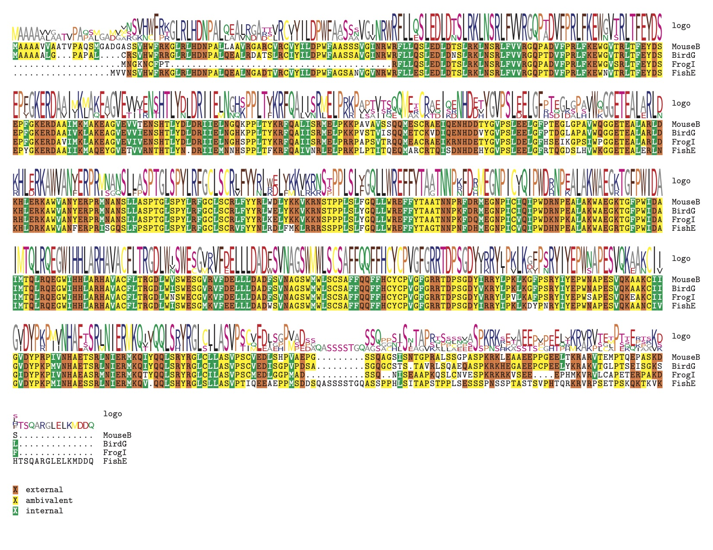
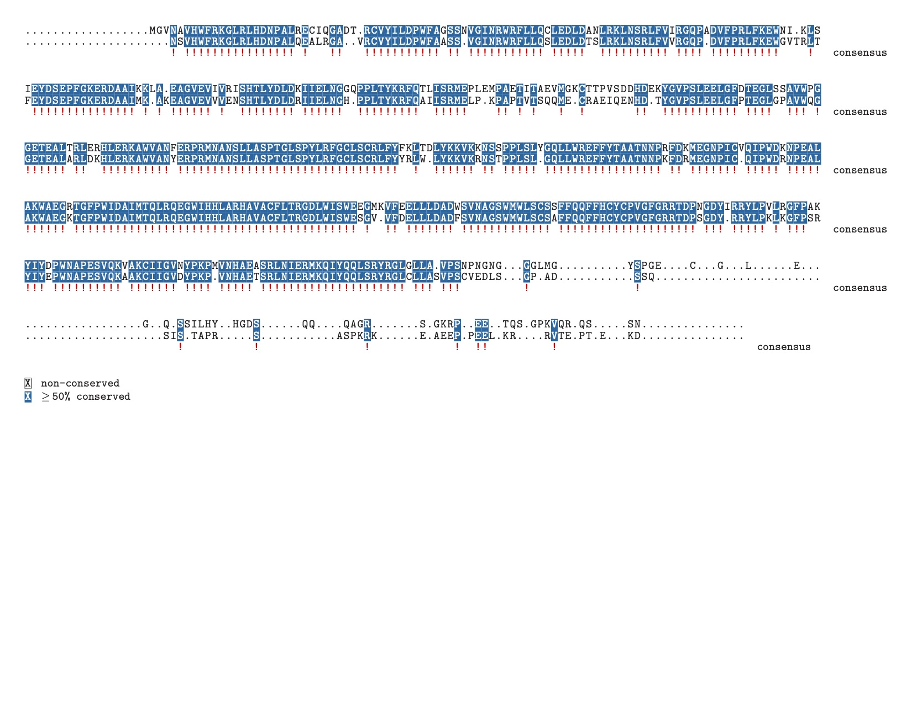
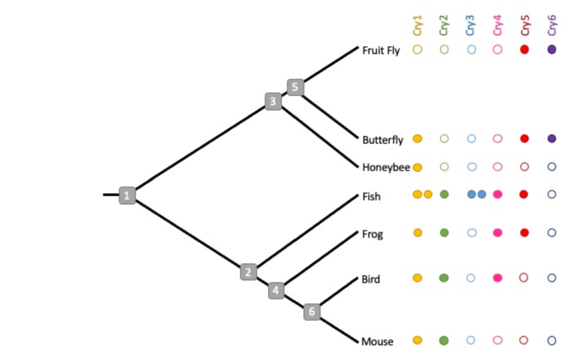

```{r setup, include=FALSE}
library(msa)
library(phangorn)
library(phytools)
library(bios2mds)
library(knitr)
library(tinytex)
knitr::opts_chunk$set(echo = TRUE)
```

## Part 1: 

### Question 1: 3 pts

##### Provide an image of your alignment. 

{width=100%}

##### Are there some parts of the sequence that do not appear as well-aligned as others, or where the sequences just look very different from one another? 

Broadly speaking, the tail end of the sequence is poorly conserved across all sequences, as well as a chunk of sequence early on in the FrogI species, some sort of insertion in the middle/end of the InsectJ species, and a messy area in the second block of sequence for all species.

##### Which of the sequences looks the most different, and what is different about it?

I would say that InsectJ looks the most distinct as it does contain a long insertion of some kind in the fifth chunk of sequences in this image.

### Question 2: 2 pts

##### Provide an image of your new Clustal-Omega alignment. 

{width=100%}

##### Can you see any differences between this alignment and the clustal-W alignment?

Yes! The FrogI species is aligned differently in the beginning of this sequence (with missing gaps in the front end of the sequence instead of a few letters in as in ClustalW.

## Part 2: 2pts

### Question 3: 

##### In terms of the scores reported by VerAlign, how did each method perform? 

Scores:


|Alignment|SP Score|CS Score|Avg SPDist Score|
|---|---|---|---|
|Clustal W|0.91|0.85|0.96|
|Clustal Omega|0.92|0.88|0.95|

Both scored better with the SP metric (proportion of matching residues) than the CS metric (proportion of identical positions$)^{1}$ but both performed well across the various metrics. 


##### Was either one overall better than the other?

The scores themselves were similar, but I did notice that in the ClustalW alignment, larger chunks of sequence in the tail end were aligned, whereas the consenses in the Clustal Omega alignment were more fragmented toward the end. I don't know that one is better on the other. 

## Part 3:

### Question 4: 1 pt

##### Provide an image of your rooted tree.



### Question 5: 1 pt each

##### For each of the following sequence pairs, determine whether their relationship is orthologous or paralogous.

(A) FishE and BirdG - orthologs

(B) FishC and FrogH - orthologs

(C) FishC and FishD - paralogs

(D) MouseA and MouseB - paralogs

(E) BirdF and FrogI - orthologs

### Question 6: 1 pt 

##### Based on this information, and looking at your tree, which set of sequences do you believe correspond to Cry1?

Fish C and D, mouse A, bird F, frog H

## Part 4: 

### Question 7: 3 pts 

##### Provide the images for you separate Cry1 and Cry2 alignments. 

<center>


</center>



##### Looking at these side by side, do any differences jump out at you? 

The beginning segment in cry1 has a much stronger consensus than cry2 and has a longer consensus sequence than cry 2. The first difference appears to be driven by divergence in the protein associated with FrogI.

##### Which parts of the sequence are most conserved in each protein, and which are least? 

Cry1 blocks 3 and 4 are almost perfectly conserved. Cry2 is most strongly conserved in block 4.

##### Do the sequences themselves look different?

They do look different, although cry2 is less conserved so it's difficult to say exactly how much they differ by at any one point without going to the species level

### Question 8: 2 pts 

##### Provide the image of your aligned consensus sequences. 



##### Are the two gene copies mostly conserved, or are there some differences?

They are pretty conserved in the middle blocks, with differences in the tails.



## Part 5: 

### Question 9: 1 pt each 

##### For each of the Cry genes, describe a possible history in terms of duplication events, gene loss events, or both, that could explain the present-day pattern observed in the above figure. Use the node numbers to be specific about when you think certain things happened. Note that there is not necessarily a single right answer in each case; the idea is just to come up with a plausible explanation given what you see.

(A) Cry1: gene loss event somewhere after node 5

(B) Cry2: duplication event after node 1 and before node 2

(C) Cry3: a duplication event within the fish population

(D) Cry4: duplication event at node 2 and subsequent loss after node 6 in the mouse population

(E) Cry5: two differing loss events: one after node 3 in bees and another after node 4 before node 6 

(F) Cry6: duplication event before node 5

### References

1) Ahola V, Aittokallio T, Vihinen M, Uusipaikka E. A statistical score for assessing the quality of multiple sequence alignments. BMC Bioinformatics. 2006 Nov 3;7:484. doi: 10.1186/1471-2105-7-484. PMID: 17081313; PMCID: PMC1687212.

