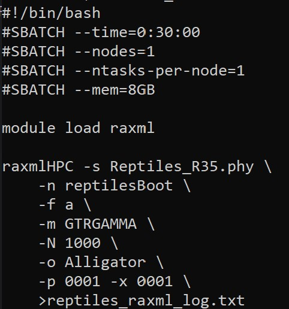
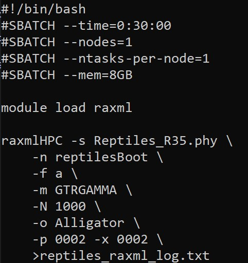

```{r setup, include=FALSE}
knitr::opts_chunk$set(echo = TRUE)

library(msa)
library(phangorn)
library(phytools)
library(castor)
```

## Background

For this exercise, you will use maximum likelihood and consensus tree methods to look at the phylogenetic relationships among several species of snakes, lizards, and these legless lizard intermediates to determine whether or not the evolution of limblessness has happened more than once.

The dataset for this exercise consists of 2 sets of sequences corresponding to 2 different genes: SLC8A1^1^ and R35^2^. Use the links associated with each gene name to download the fasta files. Each file contains DNA sequences from 12 different reptile species.

## Use Neighbor-Joining Trees to Determine Which Gene To Use

```{r determine_gene_for_use, include=FALSE}
# need to read your sequences into R
r_seqs = readDNAStringSet('Reptiles_R35.fasta')
slc_seqs = readDNAStringSet('Reptiles_SLC8A1.fasta')

# align seqs (clustal omega)
r_aligns = msa(r_seqs, method='ClustalOmega')
slc_aligns = msa(slc_seqs, method='ClustalOmega')

r_forPhang = msaConvert(r_aligns, type="phangorn::phyDat")
slc_forPhang = msaConvert(slc_aligns, type="phangorn::phyDat")

# get distance metrics (K80 + G substitution model)
r_dna = as.DNAbin(r_forPhang) # convert from phydat object to dnabin object
r_D = dist.dna(r_dna, model="K80", gamma=TRUE)

slc_dna = as.DNAbin(slc_forPhang) # convert from phydat object to dnabin object
slc_D = dist.dna(slc_dna, model="K80", gamma=TRUE)

# create trees (NJ method, alligator as outgroup)
r_nj = nj(r_D)
r_nj_root = root(phy=r_nj, outgroup='Alligator')

slc_nj = nj(slc_D)
slc_nj_root = root(phy=slc_nj, outgroup='Alligator')

# calculate multiple distance metrics to compare both trees
t.dist = treedist(slc_nj_root, r_nj_root)
```

### Question 1 (2pts)

#####  Provide the plot for your R35 neighbor-joining tree. Make sure that the tip labels are clearly readable.


```{r plot_R35, echo=FALSE, results='asis', fig.align = 'center'}
plot(r_nj_root, main="Rooted R35 Tree", cex=0.5)
```

### Question 2 (2pts)

##### Provide the plot for you SLC8A1 tree; make sure the labels are readable. 


```{r plot_SLC8A1, echo=FALSE, results='asis', fig.align = 'center'}
plot(slc_nj_root, main="Rooted SLC8A1 Tree", cex=0.6)
```

### Question 3 (1pt)

#####  How many clades (or bipartitions) are unique to EACH tree? Which score tells you this?

```{r tree_dist, echo=FALSE}
knitr::kable(t.dist, caption = 'Distance Metrics Output')
```

The Symmetric (Robinson Foulds Distance) tells us the **sum** of the number of clades unique to each tree. So there are 8 unique clades in each tree.

### Question 4 (1pt)

##### Which gene (R35 or SLC8A1) shows the correct relationships?

The R35 gene shows the correct relationships.

## Run RAxML with 1000 Bootstrap Replicates

```{r RAxML, echo=FALSE}
write.phylip(r_aligns, "Reptiles_R35.phy") # convert aligns to phylip file
```

## Question 5 (3 pts)

##### Copy and paste your 3 different RAxML commands (with all parameters), to show how you got 3 independent runs with the same data.







## Question 6 (1 pt)

##### Did your results appear to converge? Why or why not?

run_1 likelihood: -4082.569435

run_2 likelihood: -4082.569434

run_3 likelihood: -4082.569434

The highly similar optimized likelihoods suggest convergence.

## Plot your RAxML Tree with Bootstrap Values

### Question 7 (5 pts) 

##### Provide the plot of your best RAxML tree with bootstrap support values. Make sure it is clearly labeled, and all labels are legible.


```{r bootstrapping, align = "left", echo=FALSE, results='asis', fig.align = 'center'}
my.tree = read.tree("hw3_run1/RAxML_bestTree.reptilesBoot")
my.boot = read.tree("hw3_run1/RAxML_bootstrap.reptilesBoot")

plotBS(tree=my.tree, BStrees=my.boot, cex=0.75, type="phylogram", p=0, bs.col="red")
```

## Perform Ancestral State Reconstruction
```{r ASRecon, include=FALSE}
mltree = read.tree("hw3_run1/RAxML_bestTree.reptilesBoot")
TreeID = c("DragonLizard","AgamaLizard","Chamaeleon","Copperhead","Python","BoaConstrictor","Tuatara","WormLizard","GlassLizard","Galliwasp","CaliforniaLeglessLizard","Alligator")
NumLegs = c(4,4,4,0,0,0,4,0,0,0,0,4)
names(NumLegs) = TreeID

adj.NumLegs = NumLegs
NumLegs[which(NumLegs==0)] = 1
NumLegs[which(NumLegs==4)] = 2

m = match(mltree$tip.label, names(NumLegs))
adj.NumLegs = NumLegs[m]

mp_equal = asr_max_parsimony(tree=mltree, tip_states=adj.NumLegs, Nstates=2, transition_costs="all_equal")

pie.matrix = matrix(mp_equal$ancestral_likelihoods, ncol=2)
rownames(pie.matrix) = seq(12,22)
colnames(pie.matrix) = c("Legless", "Has Legs")
```

### Question 8 (5 pts)

##### Provide the plot of your RAxML tree with reconstructed states based on the "all equal" transition cost model. Make sure tip labels are clearly visible, and provide a legend to indicate which state is represented by each color in your plot.  According to these results, how many times do you think limblessness evolved? Does this suggest multiple evolutions of "4-leggedness"?

```{r ASR_plot, echo=FALSE, results='asis', fig.align = 'center'}
plotTree(mltree, offset=0.5)
tiplabels(pie = to.matrix(adj.NumLegs, sort(unique(adj.NumLegs))), piecol = c("pink", "blue"), cex = 0.3)
nodelabels(node = as.numeric(rownames(pie.matrix)), pie = pie.matrix, piecol = c("pink", "blue"), cex=0.5)
add.simmap.legend(leg=c("Legless", "Has Legs"), colors=c("pink", "blue"), prompt=FALSE, x=0.55, y=1.5)
```

It would appear that limblessness has evolved twice since the common ancestor (once by the Tuatara, and once between the worm lizard and the clade above it). The tree plot is showing no uncertainty (no splits in the pie charts)

### Question 9 (5 pts)

This time, set up a custom transition matrix, with the transition from 0 legs to 4 legs being 10 times more costly than the transition from 4 legs to 0. Then re-run the ancestral state reconstruction using maximum parsimony with the custom matrix, and plot your new results with pie charts for the reconstructed values.

```{r ASR_custom, include = FALSE}
Q = matrix(data=c(0,10,1,0), nrow=2, dimnames=list(c(1,2), c(1,2)))

mp_custom = asr_max_parsimony(tree=mltree, tip_states=adj.NumLegs, Nstates=2, transition_costs=Q)
pie.matrix2 = matrix(mp_custom$ancestral_likelihoods, ncol=2)
rownames(pie.matrix2) = seq(12,22)
colnames(pie.matrix2) = c("Legless", "Has Legs")
```

##### Provide the plot of your final tree with ancestral state reconstructions using the custom matrix. Again, make sure you have clear labels and a legend.  How does this tree compare to the previous tree in terms of the number of transitions to limblessness or 4-leggedness? 

```{r ASR_custom_plot, echo=FALSE, results='asis', fig.align='center'}
plotTree(mltree, offset=0.5)
tiplabels(pie = to.matrix(adj.NumLegs, sort(unique(adj.NumLegs))), piecol = c("pink", "blue"), cex = 0.3)
nodelabels(node = as.numeric(rownames(pie.matrix2)), pie = pie.matrix2, piecol = c("pink", "blue"), cex=0.5)
add.simmap.legend(leg=c("Legless", "Has Legs"), colors=c("pink", "blue"), prompt = FALSE, 
                  x=0.55, y=1.5)
```
This tree actually makes less sense to me as it would seem there are multiple transitions from leglessness, to having legs, and back again even within 2 completely legless clades. I suppose it's possible but it violates our notion of parsimonious tree building, I think.

## References

^1^ Reptiles_SLC8A1.fasta

^2^ Reptiles_R35.fasta