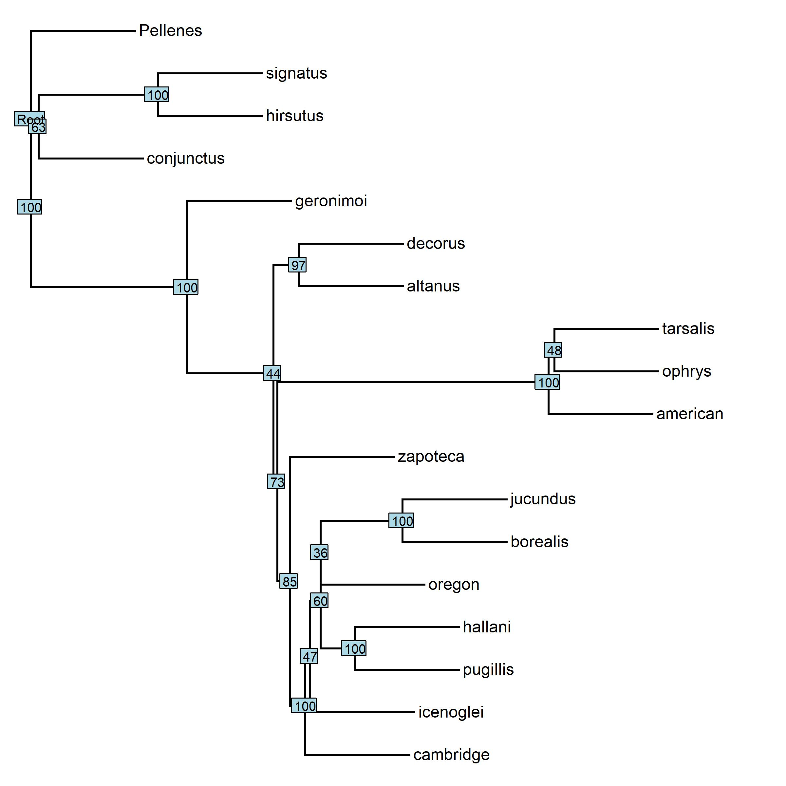

```{r setup, include=FALSE}
knitr::opts_chunk$set(echo = TRUE)

library(msa)
library(phangorn)
library(phytools)
library(castor)
library(bios2mds)
library(tidyverse)
library(lmtest)
library(MCMCtreeR)
library(evobiR)

# read in data
untar('spiders-fasta.tar.gz')

```

## Part One: Use ASTRAL to Get a Species Tree


```{r nex_aligns, echo=FALSE}
###       SETTING NOTES      ###
### Use Muscle in alignment  ###
### Use GTR + I in MrBayes   ###
### Use Pellenes as outgroup ###

# get a Nexus format alignment file for each gene
# ALSO get a concatenated alignment file for MrBayes (steps denoted ##)

my.files = list.files(path="./spiders-fasta", pattern="*.fasta", full.names=TRUE)
my.lengths = rep(0, length(my.files)) ## lengths for concat stop and starts. start with all 0
pr.aln = ""

for (i in 1:length(my.files)) {
  seqs = readDNAStringSet(my.files[i])
  my.aln = msa(seqs, method="Muscle", order="input")
  out = gsub("fasta", "nex", gsub("spiders-fasta", "nexus", my.files[i]))
  write.nexus.data(as.DNAbin(my.aln), out) # individual .nex files
  
  my.lengths[i] = ncol(my.aln) ## employ lengths
  
  temp = paste0(pr.aln,my.aln) ##
  names(temp) = rownames(my.aln) ##
  pr.aln = DNAStringSet(temp) ##
}

concat.aln = DNAMultipleAlignment(pr.aln)
write.nexus.data(as.DNAbin(concat.aln), file="SpidersConcat.nex")

### Create the partition file (for RAxML, but don't print)
my.starts = c(1)
for (i in 1:(length(my.lengths)-1)) {
     my.starts[i+1] = my.lengths[i] + my.starts[i]
}
my.ends = my.starts + (my.lengths-1)
my.loci = gsub("\\.fasta", "", basename(file.path("./spiders-fasta/", my.files)))
my.loci = paste("loc", my.loci, sep="")
info1 = paste(my.starts, my.ends, sep="-")
info2 = paste(my.loci, info1, sep="=")
info3 = paste("DNA,", info2, sep=" ")

### Create the partition file for MrBayes
info3 = gsub("DNA,", "charset", info3)
info3 = paste(info3, ";", sep="")
loc.list = paste(my.loci, collapse=",")
list.w.length = paste(c(length(my.loci), loc.list), collapse=":")
info4 = paste(c("partition", "byLocus", "=", list.w.length), collapse=" ")
info4 = paste(info4, ";", sep="")
write.table(c(info3,info4), file="Spiders-MrB-part.txt", quote=FALSE, row.names=FALSE, col.names=FALSE)

# run MrBayes on each gene (cluster)
# download the MrBayes tree results for each gene (FileZilla)
```


```{r mcc, echo = FALSE}
# use R to get the MCC tree for each gene and save it as a newick file
#tree.files = list.files(path="./nexus", pattern="*run1.t", full.names = TRUE)
#for (i in 1:length(tree.files)) {
#  out = gsub("nex\\.run1\\.t", "mcc.tre", gsub("nexus\\/", "", tree.files[i]))
#  trees = read.nexus(tree.files[i])
#  mcctree = root(mcc(trees), outgroup=c("Pellenes"))
#  write.tree(mcctree, out)
#}

# concatenate the MCC trees into one file and run ASTRAL (cluster)

```

### Question 1: Provide the plot of your ASTRAL tree with posterior probability values at each node. Make sure the tree is clearly labeled and readable. (5 pts)

```{r astral tree, echo=FALSE, fig.align='center'}
# plot
astral = read.tree("spiders_astral.tre")
astral$node.label = round(((as.numeric(astral$node.label))*100), digits=2)
astral$edge.length[which(is.na(astral$edge.length))] = 1
astral2 = root(astral, "Pellenes", resolve.root=TRUE)
jpeg("Spiders-Astral-Tree.jpg", width=8, height=8, units="in", res=300)
plotTree(astral2, edge.width=2, font=1)
nodelabels(astral2$node.label, cex=0.8)
dev.off()


```

### Question 2: Provide your Density Tree plot. Based on this plot, would you say there is a lot of phylogenetic incongruence, or only a little? (2 pts)

Based on the following plot, I'd say that there's a lot of incongruence here. The outgroup and two closest related taxa look fine, but everything else is messy. 

```{r incongruence, echo=FALSE, fig.align='center'}
# create a DensiTree plot of your set of MCC trees by...
# read in concatenated Newick tree file from ASTRAL
all.trees = read.tree("single_tree_files/Spiders_allLoci_mcc.tre")

# root with Pellenes
all.root = root(all.trees, outgroup=c("Pellenes"), resolve.root=TRUE)

# use phytools::densitytree() to get plot
densityTree(all.root, type="cladogram", alpha=0.05, compute.consensus=FALSE, use.edge.length=FALSE)

```

## Part Two: Using SNPs to Test for Gene Flow

### Question 3: Provide the plot of your SVDQuartets tree (You do not need to worry about node labels since there was no bootstrapping). (2 pts)

```{r svd tree, echo=FALSE, fig.align='center'}
svd.tree = read.nexus("paup_spider_tree.nex")
svd.tree2 = root(svd.tree, outgroup='signatus', resolve.root=TRUE)
plotTree(svd.tree2, edge.width=2, font=1)
```

### Question 4: What are your species assignments for P1, P2, and P3? (2 pts)

P1 - tarsalis

P2 - ophrys

P3  - americanus

```{r ABBA BABA, echo=FALSE}
# PERFORM ABBA BABA
small.clade.nex = read.nexus.data('spider-snps.nex') # read in nex file with snps
small.clade.seqs = as.DNAbin(small.clade.nex) # convert to DNA bin object

# generate order ("species P1", "species P2", "species P3", "species Out")
ordered.names = c("tarsalis", "ophrys", "americanus", "signatus")
m = match(ordered.names, labels(small.clade.seqs)) # match up the vector of names in correct order
new.dna.bin = small.clade.seqs[m] # re-order the DNAbin object

# write fasta file
write.FASTA(new.dna.bin, file="small_clade.fa")

#perform actual test
CalcD(alignment="small_clade.fa", sig.test="B")
```

### Question 5: Is there evidence of gene flow between any of these species? If yes, then which pair of species is exchanging genes? (3 pts)

raw D stat = 0.266

SD D Stat = 0.033

P(D = 0) = 2.22e-16

This p-value is miniscule, so we reject the null that D = 0, and operate under the assumption of a positive D value. Positive D stats suggest more ABBA sites and the presence of gene flow between either signatus or americanus with tarsalis.

### Question 6: Copy and paste the lines of code you used to specify your substitution model, the linking/unlinking of partitions, and the rate prior.  Please do NOT copy and paste all of your partition information (i.e. all of the charset lines)! (1 pt)

```{mrbayes model params, eval=FALSE}
begin mrbayes;
    set autoclose=yes nowarn=yes;
    execute SpidersConcat.nex;
    charset loc51068=1-412;
    ...
    partition byLocus = ...
    lset nst=6 rates=propinv;
    prset applyto=(all) ratepr=variable;
    ...
    unlink statefreq=(all) revmat=(all) shape=(all);
    ...
```

### Question 7: Copy and paste the lines of code you used to set up all of the node dating constraints, calibrations, and priors. (5 pts)
```{mrbayes constraints, eval=FALSE}
    ...
    constraint Hb = 1-6 8-18;
    constraint clade1 = 17 6 12;
    constraint clade2 = 6 12;
    constraint clade3 = 1-4 8-11 13-16 18;
    constraint clade4 = 11 16 1 18 10 14 2 9;
    constraint clade5 = 16 1;
    constraint clade6 = 13 15 4;
    
    calibrate clade1 = truncatednormal(2100,4800,1400);
    calibrate clade2 = truncatednormal(500,3250,1300);
    calibrate clade4 = truncatednormal(1700, 2700, 500);
    calibrate clade5 = truncatednormal(1000, 1500, 250);
    
    prset topologypr = constraint(Hb, clade1, clade2, clade3, clade4, clade5, clade6);
    prset treeagepr = truncatednormal(2500,5000,1200);
    prset brlenspr = clock:uniform;
    prset clockratepr = lognorm(-5.5,0.5);
    prset clockvarpr = igr;
    
    outgroup Pellenes;
    mcmc ngen=10000000 samplefreq=100 printfreq=1000 file=spiders_concat;
    sump relburnin=yes burninfrac=0.25;
    sumt relburnin=yes burninfrac=0.25;
end;
```

```{r title, echo=FALSE}
```

```{r title, echo=FALSE}
```


